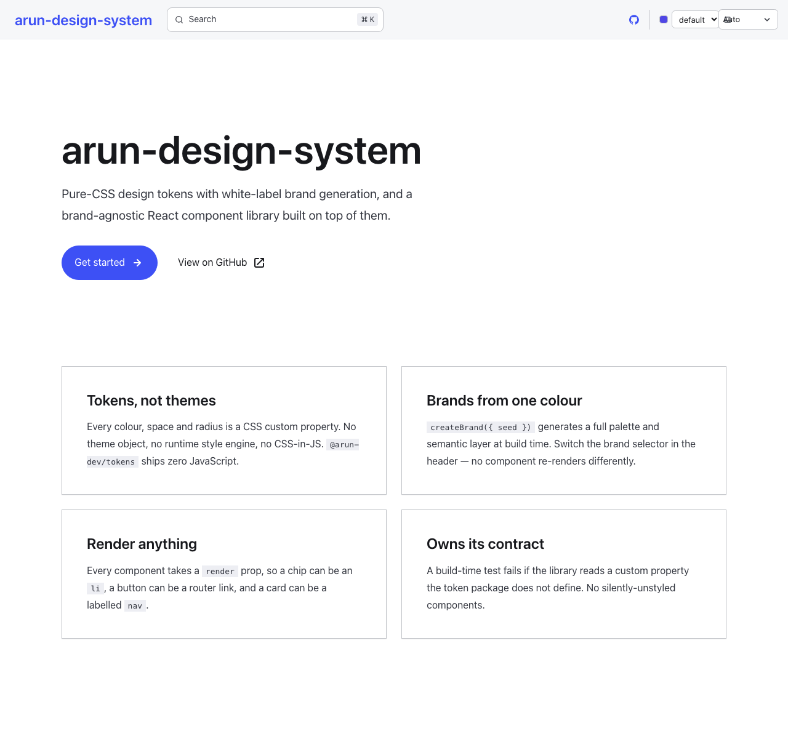
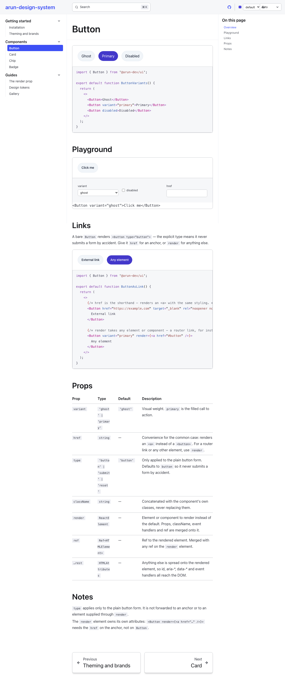

# arun-design-system

A standalone, publishable design system monorepo. Pure-CSS design tokens with white-label brand
generation, and a brand-agnostic React component library built on top of them.

## Packages

| Package                               | Description                                                                                             | Published  |
| ------------------------------------- | ------------------------------------------------------------------------------------------------------- | ---------- |
| [`@arun-dev/tokens`](packages/tokens) | Design tokens — pure CSS primitives, brand palettes, semantic layers, and the `createBrand()` generator | ✅         |
| [`@arun-dev/ui`](packages/ui)         | React components (`Button`, `Card`, `Chip`, `Badge`) styled entirely via semantic tokens                | ✅         |
| [`@arun-dev/config`](packages/config) | Internal ESLint and TypeScript base configs                                                             | ❌ private |

## Documentation

**<https://arun9483.github.io/arun-design-system/>**

Live examples, interactive playgrounds and a prop reference — an Astro Starlight site in
[`apps/docs`](apps/docs), deployed from `main`. Run it locally with
`pnpm --filter @arun-dev/docs dev`.

| Home                             | A component page                     |
| -------------------------------- | ------------------------------------ |
|  |  |

Two controls in the header demonstrate the architecture rather than the components:

- **Theme** is Starlight's own toggle. It sets `data-theme` on `<html>` — the same hook
  `@arun-dev/tokens` uses — so it drives the token layer with no glue code.
- **Brand** swaps the token layer. `sky`, `forest` and `plum` are generated from a single seed
  colour by `createBrand()` at build time; no component knows a brand exists.

Every example is a real file under `apps/docs/src/examples/`, rendered live and shown as source
from that same file — there is no second copy to drift.

## Quick start (consumers)

```bash
npm install @arun-dev/tokens @arun-dev/ui
```

```ts
// 1. Structural primitives — spacing, radius, typography, motion, shadow, elevation
import '@arun-dev/tokens/base';
// 2. Brand — palette + semantic colour tokens. REQUIRED: @arun-dev/ui reads these.
import '@arun-dev/tokens/brands/default';
// 3. Component styles
import '@arun-dev/ui/components.css';

import { Button, Card, Chip, Badge } from '@arun-dev/ui';
```

> **All three imports are required.** `@arun-dev/tokens/base` provides only the brand-independent
> primitives — it does **not** include a brand. Without step 2 every `--color-*` token is undefined
> and components render with transparent backgrounds and inherited text colour.

To ship a custom brand instead of the default, generate the CSS with `createBrand()`:

```ts
import { createBrand } from '@arun-dev/tokens/createBrand';

const css = createBrand({ name: 'acme', seed: '#0ea5e9' });
```

Write the result to a `.css` file and import it in place of `@arun-dev/tokens/brands/default`.

### Fonts

`@arun-dev/tokens/base` deliberately omits `@font-face` declarations — font loading is a consumer
concern. Next.js consumers should use `next/font/local` in `layout.tsx`; everyone else can import
`@arun-dev/tokens/primitives/fonts` directly.

### Theming

Brand and theme tokens are declared on `:root`. Light/dark/system are all supported out of the box:

| Mode   | How                                      |
| ------ | ---------------------------------------- |
| system | default — follows `prefers-color-scheme` |
| dark   | set `data-theme="dark"` on `<html>`      |
| light  | set `data-theme="light"` on `<html>`     |

See [docs/architecture.md](docs/architecture.md) for the reasoning and the full contract.

### Restyling a single component

Tokens resolve through four tiers — primitives, brand palette, semantic, component. Override at the
tier that matches the blast radius you want:

```css
:root {
  --color-text-accent: #7c3aed; /* moves every accent surface in the system */
  --chip-accent-bg: #f5f3ff; /* moves only accent chips */
}
```

Component tokens ship with `@arun-dev/tokens/base`, and are also exported standalone as
`@arun-dev/tokens/components`. Current sets: `--chip-*`, `--badge-*`.

## Two public APIs

`@arun-dev/ui` ships **both** React components and a set of plain CSS classes. Both are supported.

### 1. React components

`Button`, `Card`, `Chip`, `Badge` — imported from `@arun-dev/ui`.

Components render a sensible default element, and accept a `render` prop to change it. Props,
`className`, event handlers and refs are merged onto whatever you pass:

```tsx
<Chip render={<li />}>React</Chip>
<Button render={<NextLink href="/docs" />}>Docs</Button>
<Card render={<article />} lift>…</Card>
```

`Badge` ships generic tones — `neutral` (default), `success`, `warning`, `error`, `info`. Domain
vocabulary belongs to your app: map it onto a tone at the call site, where TypeScript checks it.

```tsx
const TONE = { beginner: 'success', intermediate: 'warning', advanced: 'error' } as const;

<Badge tone={TONE[article.difficulty]}>{LABEL[article.difficulty]}</Badge>;
```

### 2. CSS-only classes

Available once `@arun-dev/ui/components.css` is imported. Use these when you need the styling on an
element the components don't render.

| Group          | Classes                                                                                                                                                                                                                |
| -------------- | ---------------------------------------------------------------------------------------------------------------------------------------------------------------------------------------------------------------------- |
| Layout         | `stack`                                                                                                                                                                                                                |
| Spacing        | `space-2xs` `space-xs` `space-sm` `space-md` `space-lg` `space-xl` `space-2xl`                                                                                                                                         |
| Type size      | `text-size-xs` `text-size-sm` `text-size-base` `text-size-lg` `text-size-xl` `text-size-2xl` `text-size-3xl` `text-size-4xl` `text-size-5xl`                                                                           |
| Type style     | `type-display` `type-overline` `font-weight-medium` `font-weight-semibold` `font-weight-bold` `letter-spacing-wider` `line-height-tight` `line-height-snug` `line-height-relaxed` `uppercase` `capitalize` `underline` |
| Colour         | `text-color-primary` `text-color-secondary` `text-color-muted` `text-color-accent` `bar-accent`                                                                                                                        |
| Text overflow  | `truncate` `line-clamp-2` `line-clamp-3`                                                                                                                                                                               |
| Accessibility  | `sr-only`                                                                                                                                                                                                              |
| Component-only | `metric` — an accent-tinted stat container; supply your own markup (e.g. a `<dl>`)                                                                                                                                     |

Individual stylesheets are also exported for granular loading: `@arun-dev/ui/css/reset`,
`/css/btn`, `/css/card`, `/css/chip`, `/css/badge`, `/css/metric`, `/css/utilities`.

## Development

Requirements: Node >= 24, pnpm >= 10.32.1.

```bash
pnpm install
pnpm build        # turbo run build (tsup)
pnpm typecheck
pnpm lint
pnpm test:unit
```

## Releasing

Versioning and publishing are automated with [Changesets](https://github.com/changesets/changesets):

1. Add a changeset with your PR: `pnpm changeset`
2. On merge to `main`, the release workflow opens/updates a **Version Packages** PR
3. Merging that PR publishes to npm (requires the `NPM_TOKEN` repository secret)

See [CONTRIBUTING.md](CONTRIBUTING.md) for design-system rules and workflow details.
